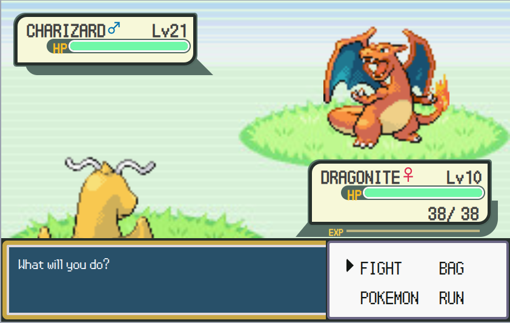
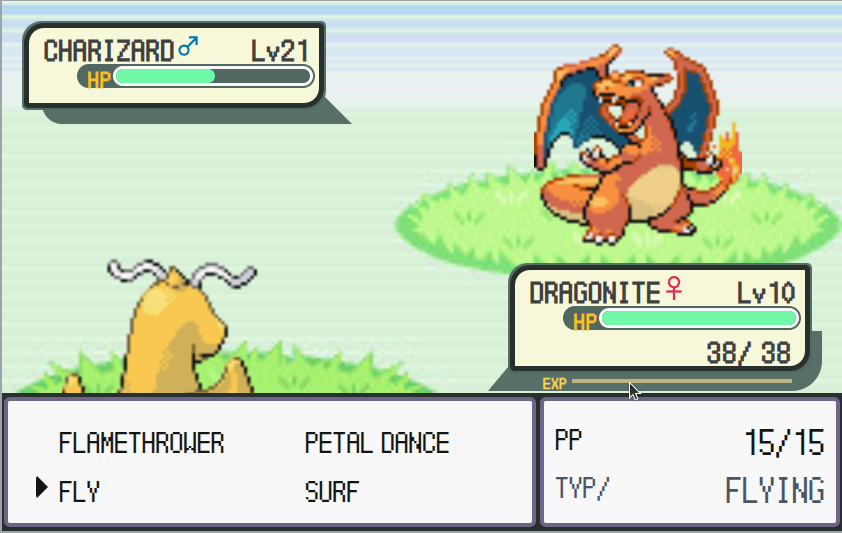

# 🎮 Pokemon Battle Game

A web-based Pokemon battle simulator built with Nuxt.js that recreates the classic Pokemon battle experience in your browser. Battle against randomly generated opponents with your Pokemon team and experience authentic turn-based combat mechanics.


## 🖼️ Screenshots




> **Note**: Screenshots will be added once the development server is running. The game features a classic Pokemon battle layout with opponent Pokemon on the top-right, player Pokemon on the bottom-left, HP bars, and a battle menu system.

## 🚀 Installation

### Prerequisites

- **Node.js** (version 14 or higher)
- **npm** or **yarn** package manager

### Quick Start

1. **Clone the repository**

   ```bash
   git clone <repository-url>
   cd pokemon-game
   ```

2. **Install dependencies**

   ```bash
   npm install

   ```

3. **Start the development server**

   ```bash
   npm run dev
   ```

4. **Open your browser**
   ```
   Navigate to http://localhost:3000
   ```

## 🎯 How to Play

1. Arrows for choose action (currently just fight) and moves
2. z for confirm action
3. x for back

## 🛠️ Available Scripts

```bash
# Development server with hot reload
npm run dev

# Build for production
npm run build

# Start production server
npm run start

# Generate static files
npm run generate
```

## 🏗️ Technologies Used

- **[Nuxt.js](https://nuxtjs.org/)** - Vue.js framework for the application structure
- **[Vue.js](https://vuejs.org/)** - Frontend framework for reactive components
- **[Tailwind CSS](https://tailwindcss.com/)** - Utility-first CSS framework for styling
- **[Vuex](https://vuex.vuejs.org/)** - State management for battle controllers
- **[SCSS](https://sass-lang.com/)** - CSS preprocessing for advanced styling
- **[pokemon-assets](https://github.com/waydelyle/pokemon-assets)** - Official Pokemon data and sprites


### Pokemon Customization

To change the default player Pokemon, modify `/components/battle/BattleBoard.vue`:

```javascript
// Change these lines in the mounted() method
const myMoves = this.$pkm.createMoves([
  'flamethrower',
  'petal dance',
  'fly',
  'surf',
])
this.myPokemon = await this.$pkm.createPokemon(
  'dragonite',
  level,
  'female',
  myMoves,
  experience
)
```

**Enjoy battling!** 🔥⚡🌊🌿
